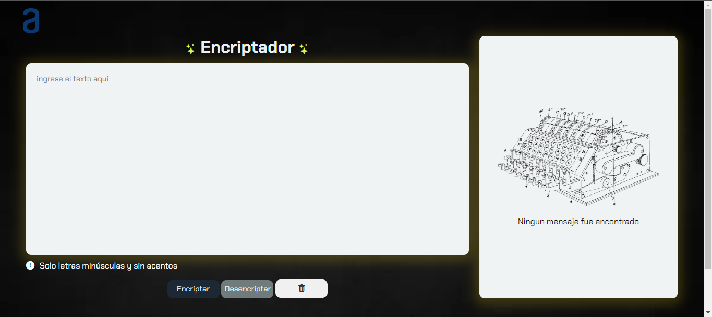

  

# Challenge Encriptador | Oracle + Alura

     

    
    
    

# Descripción

 Este proyecto es una aplicacion creada en Css, Hmtl y Javascript.
 Esta aplicacion se basa en un encriptador y desencriptar de parrafos mediande el reemplazo de un grupo de llaves, cuenta con un campo para la encriptacion y desencriptacion con sus respectivos botones tambien un boton de limpiar y un boton de copiar la frase encriptada o desencriptada.

## Claves de encriptacion
|  Llave |  Reemplazo |
|-----------|-----------|
| e | enter |
| i | imes |
| a | ai |
| o | ober |
| u | ufat |

---

## Claves de desencriptacion
|  Llave |  Reemplazo |
|-----------|-----------|
| enter | e |
| imes | i |
| ai | a |
| ober | o |
| ufat | u |

#  Requisitos

-  Debe funcionar solo con letras minúsculas
-  No deben ser utilizados letras con acentos ni caracteres especiales
-  Debe ser posible convertir una palabra para la versión encriptada también devolver una palabra encriptada para su versión original. (Ejemplos: "gato" => "gaitober" | "gaitober" => "gato")
-  La página debe tener campos para
inserción del texto que será encriptado o desencriptado, y el usuario debe poder escoger entre as dos opciones.
-  El resultado debe ser mostrado en la pantalla.
-  Un botón que copie el texto encriptado/desencriptado para la sección de transferencia, o sea que tenga la misma funcionalidad del ctrl+C o de la opción "copiar" del menú de las aplicaciones.
